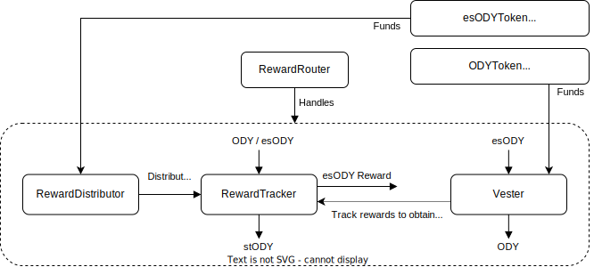

# Ondefy (ZYFI) Solidity Project

## Overview

This project involves the development of Solidity contracts to implement the tokenomics of Ondefy (ZYFI). The contracts are built using Foundry and are intended for deployment on the ZkSync network. The primary contracts developed in this project are:

1. **Staking Contract for ZYFI Token**
   - Allows users to stake ZYFI tokens.
   - Supports the minting of a non-transferable stZFY token.
   - Enables the distribution of ZYFI rewards and yield in any ERC20 token.
   - Implements a cooldown period for users wishing to withdraw from the staking contract.

2. **Escrowed Token Contract**
   - Creates an escrowed token (esZFY) that can be minted from ZYFI by the team.
   - Implements an "airdrop" mechanism to distribute esZFY to any address.
   - Escrowed tokens behave similarly to staked tokens but remain locked until the user triggers unvesting.
   - Unescrowing/unvesting results in burning esZFY and distributing ZYFI tokens over a 6-month period.

## Contract Details

### Staking Contract (Staking.sol)

The Staking contract facilitates staking of ZYFI tokens and provides functionality for managing staked tokens, rewards, and cooldown periods for withdrawals.

Key Features:

- Staking ZYFI tokens.
- Minting stZFY tokens.
- Distributing rewards in any ERC20 token.
- Implementing a cooldown period for withdrawals.

### Escrowed Token Contract (EscrowedToken.sol)

The Escrowed Token contract manages the creation and distribution of esZFY tokens, which are minted from ZYFI tokens and locked until unvesting is triggered.

Key Features:

- Creating and minting esZFY tokens from ZYFI.
- Airdropping esZFY tokens to any address.
- Locking of escrowed tokens until unvesting is initiated.
- Burning esZFY tokens and distributing ZYFI tokens over a 6-month period upon unvesting.

### Architecture
The architecture previous architecture of ODY tokenomics can be summarized in the following figure :

  
 
### New Contract details
- `Vester` : Converts stZFI into ZFI (forked from GMX's `Vester`).
- `RewardTracker` : Manages staking and convert ZFI to stZFI. Comes under the form of ERC20 token (forked from GMX's `RewardTracker`).
- `RewardDistributor` : Distributes necessary funds to `RewardTracker` for staking rewards (forked from GMX's `RewardDistributor`).
- `RewardRouter` : Pilots `RewardTracker` and `Vester` contracts for handling of rewards and full account transfer. (forked from GMX's `RewardRouterV2`).
- `ZFIToken` : ZFI token, inherits from `ERC20MinterPauserPermitUpgradeable`.

### Notable changes compared to GMX

The following differences should be noted compared with GMX architecture :
- All logic related to GLP token is not relevant for Ondefy and was removed.
- As fee distribution is not currently relevant for Ondefy, bonusGmxTracker and feeGmxTracker as well as their corresponding distributors were removed. The current staking architecture only includes a single RewardTracker/RewardDistributor pair, with esODY as reward.
- The need to reserve tokens for depositing esGMX into the Vester contract was removed.
- Reward boost feature was included in RewardTracker contract. This allows to set a boost percentage individually for any account, resulting in a higher attribution of their esODY staking rewards.
- Vesting duration is set to 6 months instead of 1 year.
- While the actual GMX and esGMX contracts inherit from a MintableBaseToken contract, ODY and esODY contracts inherit from Openzeppelin Library (supporting Role-based access control, Pausing, Minting, Burning and Permit signing) with a few modifications in order to facilitate their interaction with vesting/staking contracts.

## Deployment

To deploy the contracts on the ZkSync network, follow these steps:

Requires *Foundry* and *zkfoundry*.

1. Use `forge compile` to compile the code and install the dependencies
2. Use `forge test` to run the tests
3. Use `zkforge zk-build` to gnerate the contracts circuit for ZkSync

## Usage

Once deployed, interact with the contracts using appropriate methods provided by each contract. Refer to the contract documentation for detailed information on available methods and their usage.

## Contributors

- L0GYKAL
- Previously, Clément