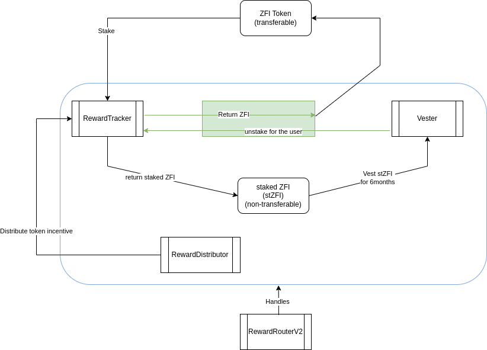

# Zyfi (ZFI) Solidity Project

## Overview

This project involves the development of Solidity contracts to implement the tokenomics of Zyfi (ZFI). The contracts are built using Foundry and are intended for deployment on the ZkSync network. The primary contracts developed in this project are:

1. **Staking for ZFI Token**
   - Allows users to stake ZFI tokens to get stZFI.
   - Supports the minting of a non-transferable stZFY token.
   - Enables the distribution of ZFI rewards and yield in an ERC20 token.
   - Implements a cooldown period for users wishing to withdraw from the staking contract (6, 12 or 24 months).

## Contract Details

### Staking Contract (Staking.sol)

The Staking contract facilitates staking of ZFI tokens and provides functionality for managing staked tokens, rewards, and cooldown periods for withdrawals.

Key Features:

- Staking ZFI tokens.
- Minting stZFY tokens.
- Distributing rewards in an ERC20 token.
- Implementing a cooldown period for withdrawals.

### Architecture
 

### New Contract details
- `Vester` : Converts stZFI into ZFI (forked from GMX's `Vester`).
- `RewardTracker` : Manages staking and convert ZFI to stZFI. User cannot convert back, they have to go through the Vester. Comes under the form of ERC20 token (forked from GMX's `RewardTracker`).
- `RewardDistributor` : Distributes necessary funds to `RewardTracker` for staking rewards (forked from GMX's `RewardDistributor`).
- `RewardRouter` : Pilots `RewardTracker` and `Vester` contracts for handling of rewards and full account transfer. (forked from GMX's `RewardRouterV2`).
- `ZFIToken` : ZFI token, inherits from `ERC20MinterPauserPermitUpgradeable`.

### Notable changes compared to GMX

The following differences should be noted compared with GMX architecture :
- All logic related to GLP token is not relevant for Ondefy and was removed.
- As fee distribution is not currently relevant for Zyfi, bonusGmxTracker and feeGmxTracker as well as their corresponding distributors were removed. The current staking architecture only includes a single RewardTracker/RewardDistributor pair, with esODY as reward. <!-- TODO: edit this sentence when fixed -->
- The need to reserve tokens for depositing esGMX into the Vester contract was removed.
- Reward boost feature was included in RewardTracker contract. This allows to set a boost percentage individually for any account, resulting in a higher attribution of their staking rewards.
- Vesting duration is depending on the instance. It is meant to be 6, 12 and 24 months (accross different staked ZFI instances) instead of 1 year.
- While the actual GMX and esGMX contracts inherit from a MintableBaseToken contract, ZFI contract inherits from Openzeppelin Library (supporting Role-based access control, Pausing, Minting, Burning and Permit signing) with a few modifications in order to facilitate its interaction with vesting/staking contracts.

### New changes:
- The RewardTracker "unstake" function has been removed
- The Vester can unstake stZFI for the user after the 6 months period
#### Vester:
When depositing stZFI in the Vester, the stZFI are unstaked from the user wallet to the Vester's contract (from stZFI to ZFI).
If the user withdraws in the meantime, the ZFI are staked for the user to their wallet (stZFI).
And when the user claims, the Vester sends ZFI to the user.

### Important details:
Also, the rewardTracker can only distribute one kind of token as reward (we chose stZFI), so if we want to distribute USDC for example, we need the user to stake again their stZFI in another rewardTracker (with the unstake function available) with a distributor of USDC

## Deployment

To deploy the contracts on the ZkSync network, follow these steps:

Requires *Foundry* and *zkfoundry*.

1. Use `forge compile` to compile the code and install the dependencies
2. Use `forge test` to run the tests
3. Use `zkforge zk-build` to gnerate the contracts circuit for ZkSync

## Usage

Once deployed, interact with the contracts using appropriate methods provided by each contract. Refer to the contract documentation for detailed information on available methods and their usage.

## Contributors

- L0GYKAL
- Previously, Clément